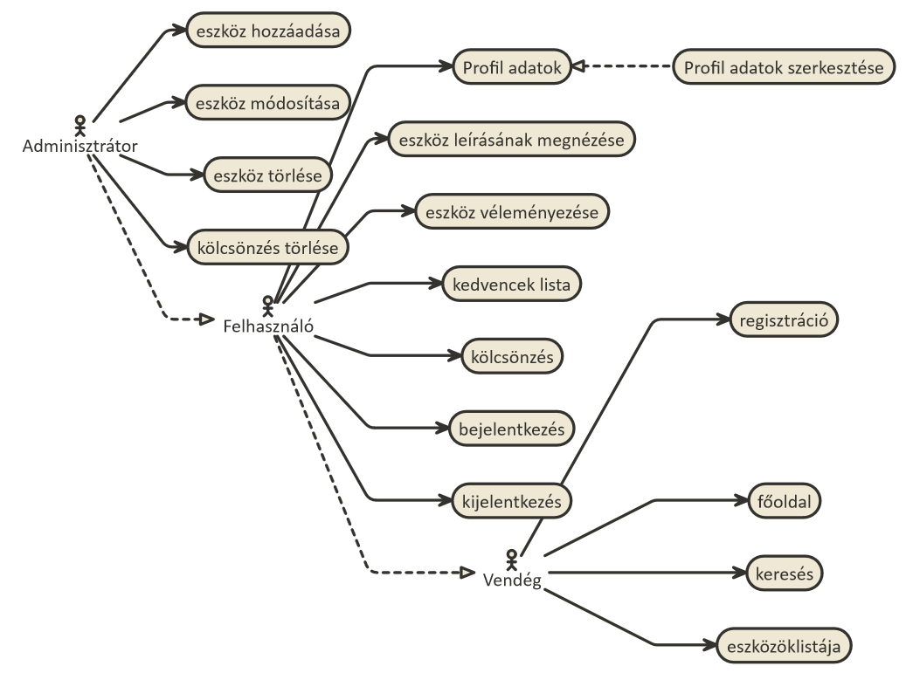
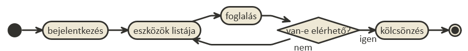
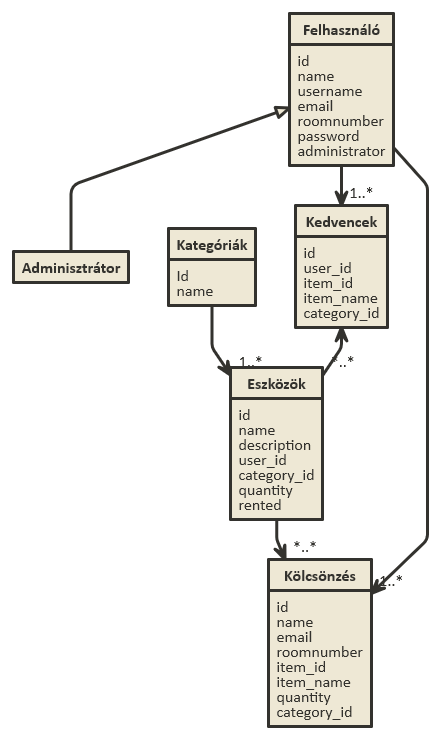
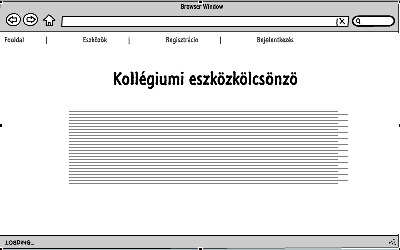
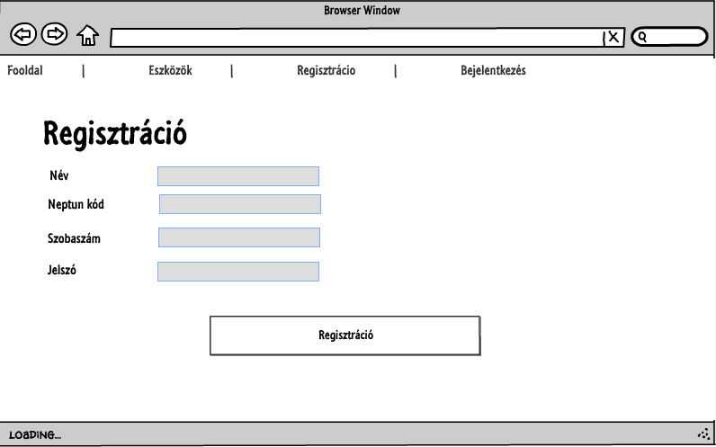
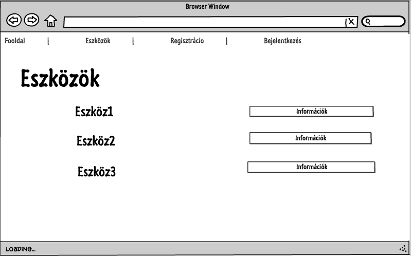
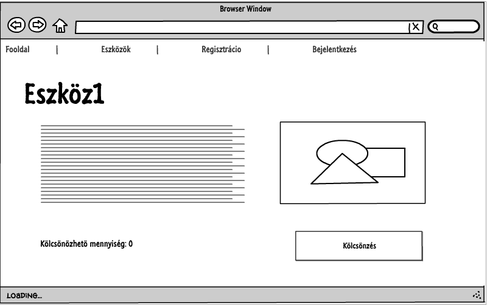

#Kollégiumi eszközkölcsönző

##**1. Követelményanalízis**
####**1.1. Célkitűzés, projektindító dokumentum**

A program legfőbb célja jól átláthatóan, és érthetően megjeleníteni a kollégiumban elérhető eszközök listáját.
Az adatok védelme érdekében legyen lehetőség regisztrációra, majd bejelentkezésre. 
Bejelentkezett felhasználó az eszközök listáját megtekintheti, valamit megjegyzéseket írhat.
Az adminisztrátorok bővíthetik az eszközök listáját, módosíthatják a leírásukat, valamint törölhetik az eszközöket.

######Funkcionális követelmények

- Vedégként a főoldalon szeretnék kapni egy ismertető szöveget.
- Vendégként a főoldalon szeretnék tudni beregisztrálni.
- Vendégként a főoldalon szeretnék tudni bejelentkezni.
- Vendégként szeretném az elérhető eszközök listáját megtekinteni.
- Vendégként szeretnék eszközt keresni.
- Felhasználóként szeretném látni az eszközök leírását.
- Felhasználóként szeretnék tudni véleményt írni az eszközről.
- Felhasználóként szeretnék kedvencek listát létrehozni az eszközökből.
- Felhasználóként szeretnék keresni az eszközök között.
- Felhasználóként szeretnék eszközt kölcsönözni.
- Adminisztrátorként szeretnék új eszközt hozzáadni.
- Adminisztrátorként szeretnék eszközöket törölni.
- Adminisztrátorként szeretnék eszközleírást módosítani. 

######Nem funkcionális követelmények

- Könnyű és átlátható kezelőfelület
- Gyors működés.
- Biztonságos működés: Jelszavak elrejtése, funkciók hozzáféréséhez való helyes kezelés.
- Karbantarthatóság

####**1.2 Szakterületi fogalomjegyzék**

**Eszköz:** Kézzel fogható tárgy, amely valamilyen funkciót lát el.

**Kölcsönzés:** Egy eszköz hosszabb-rövidebb időre elkérése használatra.

####**1.3. Használatieset-modell, funkcionális követelmények**

**Vendég:** Csak publikus oldalakat ér el.

- Főoldal
- Regisztráció
- Bejelentkezés
- Eszközök listája
- Keresés

**Felhasználó:** Vendég és egyéb plusz funkciók

- Eszközök leírásának megtekintése
- Eszközök véleményezése
- Kedvencek lista létrehozása
- Kölcsönzés

**Adminisztrátor:** Legmagasabb szerepkör, felhasználói és vendégfunkciókon túl

- Eszközök hozzáadása
- Eszközök leírásának módosítása
- Eszközök törlése
- Eszközkölcsönzés törlése

**Példa egy folyamatra**

Felhasználóként kölcsönzés:
	- A felhasználó bejelentkezik
	- Megnyitja az eszközök listáját
	- A kiválasztott eszköznél rányom a foglalás gombra
	- Ha van foglalható akkor kikölcsönzi, ha nincs akkor új eszközt keres
	- Végez, vagy több eszközt kölcsönözn
	

##**2. Tervezés**
####**2.1. Architektúra terv**
######2.1.1. Komponensdiagram
######2.1.2. Oldaltérkép:
**Publikus:**

- Főoldal
- Eszközök listája
- Bejelentkezés
- Regisztráció

**Felhasználó:**

- Főoldal
- Eszközök listája
  - Eszköz megtekintése
    - Eszköz véleményezése
    - Eszköz kölcsönzése
- Eszközök keresése
- Saját profil
- Kijelentkezés

**Adminisztrátor**

- Főoldal
- Eszközök listája
  - Eszközök felvétele
  - Eszközök módosítása
  - Eszközök törlése
  - Kölcsönzések törlése
  
######2.1.3. Végpontok:

- `GET/`: főoldal
- `GET/login`: bejelentkező oldal
- `POST/login`: bejelentkező adatok felküldése
- `GET/login/signup`: regisztrációs oldal
- `POST/login/signup`: regisztrációs adatok felküldése
- `GET/logout`: kijelentkező oldal
- `GET/items/list`: eszközlista oldal
- `GET/items/id`: eszköz adatok
- `POST/items/id`: új vélemény felvitele
- `GET/items/favourit`: kedvencekhez adás
- `POST/items/favourit`: kedvencekhez adás, adatok felküldése
- `POST/items/reserve=id`: eszköz kölcsönzése
- `GET/items/new`: új eszköz felvétele
- `POST/items/new`: új eszköz felvételéhez szükséges adatok felküldése
- `GET/items/delete=id`: eszköz törlése
- `GET/items/edit=id`: eszköz módosítása
- `POST/items/edit=id`: eszköz módosítása, adatok felküldése

######2.1.4. Osztálymodell:

######2.1.5. Oldalvázlat:

