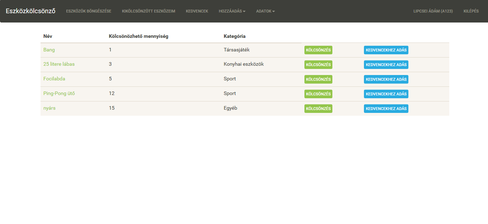

#Kollégiumi eszközkölcsönző

##**1. Követelményanalízis**
####**1.1. Célkitűzés, projektindító dokumentum**

A program legfőbb célja jól átláthatóan, és érthetően megjeleníteni a kollégiumban elérhető eszközök listáját.
Az adatok védelme érdekében legyen lehetőség regisztrációra, majd bejelentkezésre. 
Bejelentkezett felhasználó az eszközök listáját megtekintheti, valamit megjegyzéseket írhat.
Az adminisztrátorok bővíthetik az eszközök listáját, módosíthatják a leírásukat, valamint törölhetik az eszközöket.

######Funkcionális követelmények

- Vedégként a főoldalon szeretnék kapni egy ismertető szöveget.
- Vendégként a főoldalon szeretnék tudni beregisztrálni.
- Vendégként a főoldalon szeretnék tudni bejelentkezni.
- Vendégként szeretném az elérhető eszközök listáját megtekinteni.
- Felhasználóként szeretném látni az eszközök leírását.
- Felhasználóként szeretnék kedvencek listát létrehozni az eszközökből.
- Felhasználóként szeretnék eszközt kölcsönözni.
- Adminisztrátorként szeretnék új eszközt hozzáadni.
- Adminisztrátorként szeretnék eszközöket törölni.
- Adminisztrátorként szeretnék eszközleírást módosítani. 

######Nem funkcionális követelmények

- Könnyű és átlátható kezelőfelület
- Gyors működés.
- Biztonságos működés: Jelszavak elrejtése, funkciók hozzáféréséhez való helyes kezelés.
- Karbantarthatóság

####**1.2 Szakterületi fogalomjegyzék**

**Eszköz:** Kézzel fogható tárgy, amely valamilyen funkciót lát el.

**Kölcsönzés:** Egy eszköz hosszabb-rövidebb időre elkérése használatra.

####**1.3. Használatieset-modell, funkcionális követelmények**

**Vendég:** Csak publikus oldalakat ér el.

- Főoldal
- Regisztráció
- Bejelentkezés
- Eszközök listája

**Felhasználó:** Vendég és egyéb plusz funkciók

- Eszközök leírásának megtekintése
- Kedvencek lista létrehozása
- Kölcsönzés

**Adminisztrátor:** Legmagasabb szerepkör, felhasználói és vendégfunkciókon túl

- Eszközök hozzáadása
- Eszközök leírásának módosítása
- Eszközök törlése
- Eszközkölcsönzés törlése

**Példa egy folyamatra**

Felhasználóként kölcsönzés:
	- A felhasználó bejelentkezik
	- Megnyitja az eszközök listáját
	- A kiválasztott eszköznél rányom a foglalás gombra
	- Ha van foglalható akkor kikölcsönzi, ha nincs akkor új eszközt keres
	- Végez, vagy több eszközt kölcsönözn
	

##**2. Tervezés**
####**2.1. Architektúra terv**
######2.1.1. Komponensdiagram
######2.1.2. Oldaltérkép:
**Publikus:**

- Főoldal
- Eszközök listája
- Bejelentkezés
- Regisztráció

**Felhasználó:**

- Főoldal
- Eszközök listája
  - Eszköz megtekintése
    - Eszköz hozzáadása a kedvencekhez
    - Eszköz kölcsönzése
- Saját profil
- Kijelentkezés

**Adminisztrátor**

- Főoldal
- Eszközök listája
  - Eszközök felvétele
  - Eszközök módosítása
  - Eszközök törlése
  - Kategóriák felvétele, törlése
  - Kölcsönzések törlése
  
######2.1.3. Végpontok:

- `GET/`: főoldal
- `GET/login`: bejelentkező oldal
- `POST/login`: bejelentkező adatok felküldése
- `GET/register`: regisztrációs oldal
- `POST/register`: regisztrációs adatok felküldése
- `GET/logout`: kijelentkező oldal
- `GET/profile`: profil oldal
- `POST/profile`: profil oldal adatok felküldése
- `GET/users`: regisztrált felhasználók
- `GET/items/list`: eszközlista oldal
- `GET/items/id`: eszköz adatok
- `GET/myitems`: kikölcsönzött eszközeim 
- `GET/items/rented/`: összes kikölcsönzött eszköz
- `GET/items/rented/id/delete`: kölcsönzés törlése
- `GET/favourites`: kedvencekhez eszközeim
- `GET/items/:id/favourite`: kedvencekhez adás
- `GET/categories/create`: kategória hozzáadása
- `POST/categories/create`: kategória hozzáadása, adatok felküldése
- `GET/categories/list`: kategóriák listája
- `GET/categories/list/:id/delete`: kategória törlése
- `POST/items/:id/rent`: eszköz kölcsönzése
- `GET/items/:id/rent`: eszköz kölcsönzése, adatok felküldése
- `GET/items/create`: új eszköz felvétele
- `POST/items/create`: új eszköz felvételéhez szükséges adatok felküldése
- `GET/items/:id/delete`: eszköz törlése
- `GET/items/:id/edit`: eszköz módosítása
- `POST/items/:id/edit`: eszköz módosítása, adatok felküldése

######2.1.4. Osztálymodell:

######2.1.5. Oldalvázlat:

######2.1.6. Designtervek

.png)

##3. Implementáció

######3.1.1. Fejlesztőkörnyezet

Lokális környezet: Visual Studio Code
 - Mappa létrehoza
 - npm install
 - AdonisJS telepítése
 - .env.example fájl átnevezése .env-re
 - npm run dev paranccsal futtatni
 - localhost:3333 megnyitása
 - tudunk commitolni és pusholni Guthub-ra

 ######3.1.2. Könyvtárstruktúra

 alkfejl-beadando
  - Controllers: 
      - CategoryController.js
      - FavouriteController.js
      - ItemController.js
      - RentController.js
      - UserController.js
  - Model
      - Category.js
      - Favourite.js 
      - Item.js 
      - Rent.js 
      - Token.js
      - User.js 
   - resources
    - views
     - categorylist.njk
     - createCategory.njk
     - createItem.njk
     - editItem.njk
     - itemlist.njk
     - itemSearch.njk
     - layout.njk
     - login.njk
     - main.njk
     - myFavourites.njk
     - myItems.njk
     - register.njk
     - rentItem.njk
     - showItem.njk
     - showRenteditems.njk
     - userlist.njk
     - userProfile.njk
   - .env
   - ace
   - package.json
   - README.MD
   - server.js

##4. Felhasználói dokumentáció

  Futtatáshoz szükséges operációs rendszer: Tetszőleges operációs rendszer
  Futtatáshoz szükséges hardver: Operációs rendszerek szerint megadva
  Egyéb követelmények: Internet böngésző telepítése, JavaScript ajánlott

  **Program használata**
  1, Böngészőben a főoldal megnyitása
  2, Bejelentkezés vagy Regisztráció
  3, Eszközök böngészése menüpont
  4, Az eszköz nevére kattintva nézhetjük meg a tulajdonságait
  5, Kedvencek gombbal a kedvencekhez adhatjuk
  6, Kölcsönzés gombbal a mennyiség megadása után kikölcsönözhetjük
  7, Kikölcsönzött eszközök menüpontban látható az összes kölcsönzésünk
  8, Kedvencek menüpontban láthatóak a kedvenceink

  **Adminisztrátor**
  1, Hozzáadás gombbal adhatunk hozzá kategóriát és eszközt
  2, Eszköz hozzáadásakor ellenőrzi, hogy kitöltöttük e az adatokat
  3, Adatok menüpont alatt találjuk a felhasználók, eszközök és kategóriák menüket
  4, Tudunk kategóriát rötölni, ha a kategória üres
  5, tudunk eszközt törölni
  6, Tudunk kölcsönzést törölni